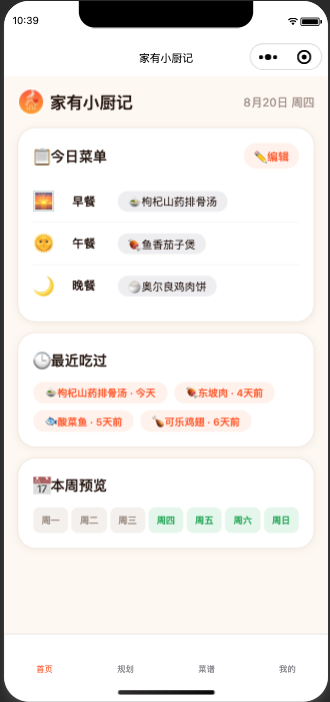
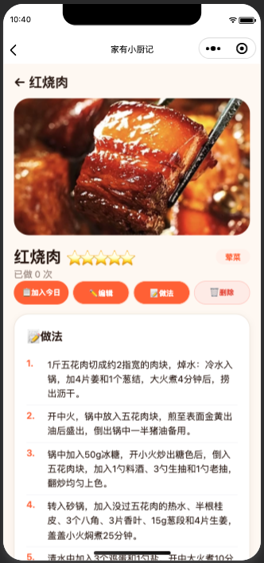

# 家有小厨记（homeChef）

一款面向家庭的微信小程序：记录家里的菜谱、规划每天的一日三餐，帮你回答「今天吃什么」。

- 个人菜谱库：几百道家常菜，带图标、评分、步骤做法、封面图
- 三餐规划：周视图规划早/午/晚餐，历史记录可一键复制到今日
- 数据统计：最常吃排行、已规划天数等个人统计
- 每个用户独立数据：基于微信云开发，数据按用户自动隔离

## 功能特性

### 🏠 首页
- 今日菜单：早餐 🌅 / 午餐 🌞 / 晚餐 🌙 一目了然，点击菜品直达详情
- 最近吃过：最近 5 天用餐记录回顾
- 本周预览：一周 7 天的规划情况小徽章
- 预加载：后台预取菜谱页数据，切换 Tab 秒开

### 📅 规划
- **周视图**：本周/未来周 7 日网格，已过去的日期锁定只读
- **随机填充**：🎲 一键为未规划的未来日期随机生成三餐
- **清空本周**：删除今天起的全部规划（历史记录保留）
- **日编辑**：点击某天，为每个餐次从菜谱库挑选菜品（支持搜索、分页）
- **历史视图**：按月浏览历史规划，📋 一键复制某天到今日

### 📖 菜谱
- 搜索 + 分类筛选 + 网格/列表双布局，无限滚动分页
- 菜品卡片：图标、名称、星级、已做次数
- 多选批量操作：📋 一键加入今日三餐、批量删除、批量改分类

### 📝 详情
- 封面图（支持拍照/相册上传、压缩）、星级、分类标签、已做次数
- 编辑功能：重命名（查重）、改分类、换图标（自定义 emoji 库）、按行编辑步骤做法
- 加入今日、删除（二次确认）

### 👤 我的
- 统计概览：菜品数、分类数、图标数、规划天数、最常吃菜品
- **菜品管理**：搜索/筛选/分页，编辑、删除、批量操作、新增
- **分类管理**：增删改、长按拖拽排序（带震动反馈）、删除分类时菜品自动归入「其他」
- **图标管理**：自定义 emoji + 约 170 个推荐图标库（支持中文关键字搜索）
- **总记录**：全部历史规划记录
- **最常吃**：按规划中出现次数排名的菜品榜单

## 界面截图

| 首页 | 规划 | 菜谱 |
| --- | --- | --- |
|  |  |  |

| 详情 | 我的 |
| --- | --- |
|  |  |

> 截图请放在 `docs/screenshots/` 目录下，文件名与上表对应（`home.png`、`plan.png`、`recipe.png`、`detail.png`、`profile.png`）。

## 技术栈

| 层面 | 技术 |
| --- | --- |
| 前端 | 微信小程序原生框架 + TypeScript |
| 后端 | 微信云开发 CloudBase（云函数 + 云数据库 + 云存储） |
| 云函数 | `getOpenId`、`seedData`（Node.js，`wx-server-sdk`） |
| 缓存 | Storage + 内存缓存双级，首屏秒开；图片 fileID → 本地路径缓存 |

## 项目结构

```
homeChef/
├── app.ts / app.json / app.wxss   # 小程序入口
├── pages/
│   ├── home/                      # 首页（今日菜单、最近吃过、本周预览）
│   ├── plan/                      # 规划（周视图、历史视图）
│   ├── recipe/                    # 菜谱库（搜索、分类、多选）
│   ├── detail/                    # 菜品详情与编辑（?id=new 为新增）
│   └── profile/                   # 我的（统计、菜品/分类/图标管理）
├── cloudfunctions/
│   ├── getOpenId/                 # 获取用户 openid
│   └── seedData/                  # 首次启动为用户初始化数据（496 道菜、7 个分类、50 个图标）
├── utils/
│   ├── db.ts                      # 云数据库封装 + 缓存层
│   ├── util.ts                    # 日期工具、MEALS 三餐配置、emoji 库
│   └── image-cache.ts             # 云存储图片本地缓存
├── typings/index.d.ts             # 全局类型定义
└── scripts/                       # 数据维护脚本（种子菜谱镜像、分类、分析）
```

## 数据模型（云数据库集合）

| 集合 | 说明 | 主要字段 |
| --- | --- | --- |
| `dishes` | 菜品 | `name`、`category`、`emoji`、`stars`(1-5)、`count`(做过次数)、`image`(云存储 fileID)、`steps[]`、`note` |
| `categories` | 分类 | `name`、`isSystem`、`order` |
| `meal_plans` | 每日规划 | `date`(YYYY-MM-DD，每天一条)、`meals: { breakfast[], lunch[], dinner[] }`（存储为 `"emoji 菜名"`） |
| `user_settings` | 用户设置 | `customEmojis[]`、`seedInitialized` |

> 所有集合均带有 `_openid` 字段，由微信云开发自动写入，实现多用户数据隔离。

## 部署指南

### 1. 准备

- [微信开发者工具](https://developers.weixin.qq.com/miniprogram/dev/devtools/download.html)（建议稳定版）
- 一个微信小程序 AppID（本项目已在 `project.config.json` 配置，可替换为你自己的）
- 微信云开发环境（需开通，有免费额度）

### 2. 导入项目

1. 打开微信开发者工具 → 导入项目
2. 目录选择本仓库（`homeChef/` 为小程序源码目录）
3. AppID 使用你自己的小程序 AppID
4. 选择 TypeScript 编译插件（若未开启，在「详情 → 本地设置」中勾选 `useCompilerPlugins: typescript`）

### 3. 开通云开发环境

1. 工具栏点击「云开发」→ 开通并创建环境
2. 记下环境 ID（形如 `cloud1-xxxxxxxxxxxx`）

### 4. 配置环境 ID

在 `homeChef/app.ts` 中修改：

```ts
cloudEnvId: '你的云开发环境ID'
```

### 5. 部署云函数

在微信开发者工具中：

1. 展开 `cloudfunctions/` 目录
2. 右键 `getOpenId` →「上传并部署：云端安装依赖」
3. 右键 `seedData` →「上传并部署：云端安装依赖」

### 6. 创建数据库集合

在云开发控制台 → 数据库，创建 4 个集合：

- `dishes`
- `categories`
- `meal_plans`
- `user_settings`

权限建议设置为「仅创建者可读写」。

### 7. 首次启动初始化

小程序首次启动会自动调用 `seedData` 云函数：

- 为当前用户创建 7 个默认分类（荤菜、素菜、汤、主食、凉菜、小吃、其他）
- 导入 496 道默认菜品（含图标、评分、步骤，图片存储在 `dishes/seed-recipes/` 路径下）
- 预置 50 个自定义图标

> 仅首次启动执行，之后会跳过（由 `user_settings.seedInitialized` 标记）。

## 本地开发

```bash
# 安装类型声明（仅前端工程，云函数自带依赖）
cd homeChef && npm install
```

- 用微信开发者工具打开 `homeChef/` 目录即可预览调试
- 真机预览需在「详情 → 域名信息」中将云开发环境加入 request 合法域名（使用云开发时通常自动处理）

## 数据维护脚本

`scripts/` 下为种子数据维护工具（Node.js，需自行配置云环境凭据）：

- `mirror-seed-recipe-images.js`：将本地菜谱图片镜像到云存储
- `reclassify-seed-recipes.js`：批量调整种子菜谱分类
- `analyze-seed-variants.js`：分析种子菜谱变体数据

## 说明

- 本项目仅供学习/家庭自用，所有功能均基于微信云开发免费额度即可运行
- 推荐使用 2.2.3 及以上基础库（云开发最低要求）
